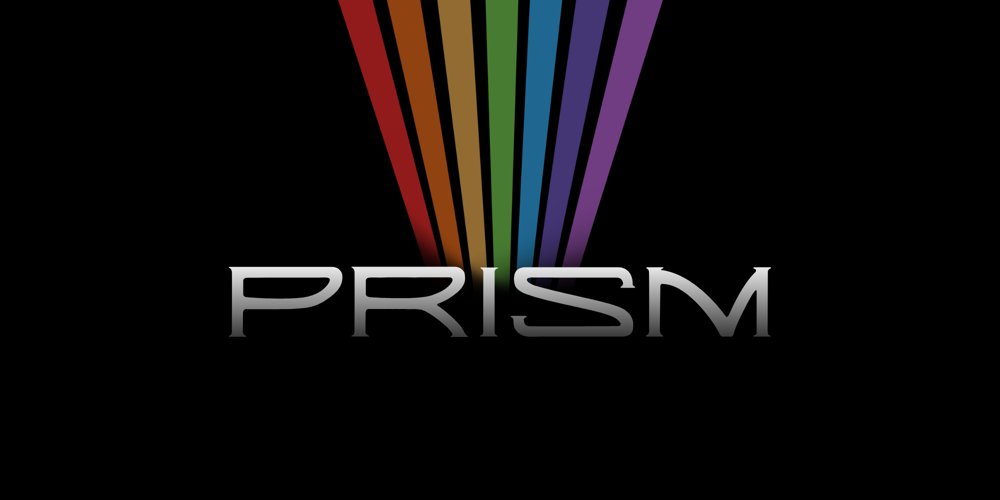
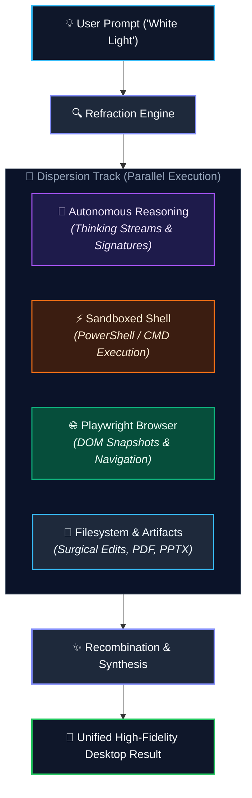
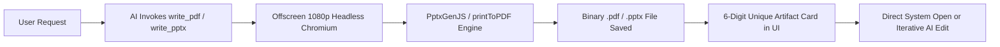
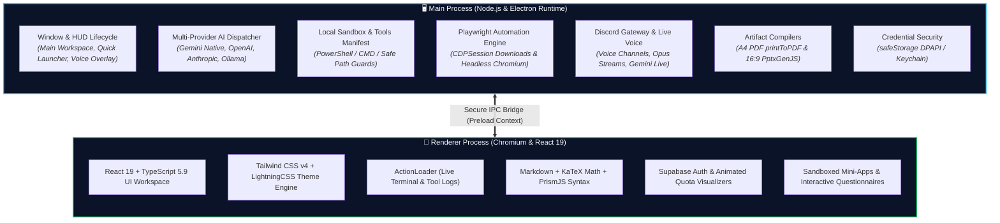

<div align="center">



<br />
<br />

# Prism

### The Open, Multi-Provider Desktop AI Copilot & Autonomous Execution Engine

[](https://github.com/brnalemusic/Prism)
[](./LICENSE)

<br />

<p align="center">
  <b>Prism</b> is a state-of-the-art desktop AI assistant that bridges cutting-edge Large Language Models with direct operating system control. Featuring a <b>Multi-Provider Engine</b>, <b>Global Quick Launcher</b>, <b>Guarded Terminal Sandbox</b>, <b>Persistent Playwright Browser Automation</b>, <b>Native PDF & 16:9 PPTX Slide Compilation</b>, <b>Discord Live Voice Gateway</b>, and <b>Modular Skills</b>, Prism transforms AI from a simple web chatbot into an omnipotent local copilot.
</p>

<br />

---

</div>

## 📑 Table of Contents

- [The Metaphor & Origin](#-the-metaphor--origin)
- [Key Architectural Pillars](#-key-architectural-pillars)
  - [1. Multi-Provider & Dynamic Model Engine](#1-multi-provider--dynamic-model-engine)
  - [2. Global Quick Launcher & Screen Vision](#2-global-quick-launcher--screen-vision)
  - [3. Guarded Local Sandbox & OS Execution](#3-guarded-local-sandbox--os-execution)
  - [4. Persistent Playwright Browser Automation](#4-persistent-playwright-browser-automation)
  - [5. Native PDF & 16:9 PPTX Slide Generation](#5-native-pdf--169-pptx-slide-generation)
  - [6. Discord Gateway & Real-Time Live Voice](#6-discord-gateway--real-time-live-voice)
  - [7. Modular Skills System](#7-modular-skills-system)
  - [8. Interactive Mini-Apps & Questionnaires](#8-interactive-mini-apps--questionnaires)
- [Visual Design & Styling](#-visual-design--styling)
- [Complete System Tools Reference](#-complete-system-tools-reference)
- [Keyboard Shortcuts Cheat Sheet](#-keyboard-shortcuts-cheat-sheet)
- [Tech Stack & Architecture](#-tech-stack--architecture)
- [Getting Started & Development](#-getting-started--development)
- [Author & Credits](#-author--credits)

---

## 💎 The Metaphor & Origin

> *"In an optical prism, a singular beam of white light enters and is refracted into a vibrant, multi-wavelength spectrum of colors. In Prism, a singular user prompt enters and is dispersed across parallel execution tracks — terminal commands, browser actions, filesystem mutations, and visual artifacts — before being recombined into a coherent, high-fidelity result."*

Prism was created by **Breno Alexandre** ([@brnalemusic](https://github.com/brnalemusic)), a systems architect and audio engineer. In music production, a Digital Audio Workstation (DAW) coordinates instruments, plugins, routing lines, and signals through a centralized mixing console. Prism applies that exact philosophy to AI: rather than relying on a siloed model trapped in a web browser, Prism acts as a central maestro routing tasks across specialized system tools, browser sessions, and local environments with microsecond responsiveness.



---

## 🚀 Key Architectural Pillars

### 1. Multi-Provider & Dynamic Model Engine

Prism breaks free from proprietary vendor lock-in. Connect trusted cloud providers, accelerated inference engines, or local offline LLMs with independent model assignments across different features.

<div align="center">

| Provider Category | Supported Platforms / Endpoints | Paradigms |
| :--- | :--- | :--- |
| **Trusted Cloud** | **Google AI Studio** (`gemini-3.7-flash`, `gemini-3.6-pro`, `gemini-3.5-flash-lite`)<br/>**OpenAI GPT** (`gpt-5.6-sol`, `gpt-5.6-terra`, `gpt-5.6-luna`, `gpt-4o`)<br/>**Anthropic Claude** (`claude-sonnet-5`, `claude-opus-5`, `claude-haiku-4.5`) | `gemini_native`<br/>`chat_completions`<br/>`anthropic_messages` |
| **Accelerated Cloud** | **GroqCloud**, **Cerebras AI**, **Puter.js**, **NVIDIA NIM**, **OpenRouter** | `chat_completions` |
| **Local & Custom** | **Ollama**, **LM Studio**, **vLLM**, **LocalAI**, Custom Base URLs | OpenAI / Anthropic Compatible |

</div>

- **Dynamic Model Discovery & Puter.js Native Account:** Automatically queries `/models` endpoints or native Puter.js SDK (`puter.ai.listModels()`), with seamless default browser login for Puter accounts.
- **Granular Role Routing:** Independently assign dedicated models for:
  - 💬 **Main Chat Model** (Deep reasoning, coding, and workflow orchestration)
  - 🌐 **Generative Browser Model** (Real-time HTML+CSS website synthesis via `generate:`)
  - 🔍 **Web Search Model** (Fast grounding & real-time summarization)
  - ⚡ **Quick Launcher Model** (Sub-second inline responses & calculations)
  - 🎙️ **Dictation / STT Model** (High-accuracy speech-to-text transcription)
  - 🤖 **Discord Gateway & Voice Model** (Real-time live voice chat & channel responses)
- **Streaming Reasoning & Thought Signatures:** Real-time extraction of thinking tokens (`reasoning_content`, `reasoning`, `thinking`) into a collapsible UI thoughts panel, with Google Gemini multi-turn `thought_signature` state preservation across tool loops.
- **Multi-Level Reasoning:** Configurable thinking budgets (`minimal`, `low`, `medium`, `high`) per model.

---

### 2. Global Quick Launcher & Screen Vision

Press `Ctrl+Space` (or `Cmd+Space` on macOS) anywhere in your operating system to summon the floating HUD overlay.

- **Dual Operating Modes:**
  - **Simple Mode (Default):** Instant desktop overlay for quick answers, arithmetic, file lookups, and app launching without leaving your current workspace.
  - **Advanced Mode:** Forwards the prompt directly into the full multi-pane chat workspace.
- **Screenshot & Ask (`Ctrl+Alt+Space`):** Instantly captures the entire screen, triggers a refractive border glow animation, and attaches the screenshot to your prompt for instant vision-based analysis.
- **Installed App Launcher:** Fuzzy search all installed software and launch executables with native icons.
- **Workspace File Search:** Real-time file indexer to locate and open local documents on the fly.
- **Inline Calculator:** Evaluates mathematical expressions directly with one-click clipboard copying.
- **Inline Model Selector (`Ctrl+M`):** Toggle active AI engines on the fly right from the launcher.

---

### 3. Guarded Local Sandbox & OS Execution

Prism allows AI models to interact safely with your computer through a hardened sandbox runtime (`localCommandSandbox.ts` & `systemTools.ts`).

- **Configurable Terminal Shell:** Execute commands natively in `powershell.exe`, `pwsh.exe`, or `cmd.exe`.
- **Path Guardrails & Security Assertions:** Prevents accidental or unauthorized modifications to sensitive operating system files, system registries, or critical boot roots via `assertSafeFileMutationPath` and `assertSafeBulkMutationPath`.
- **Surgical File Operations:** Read bounded line ranges, create files, write full content, append text, and perform precise line replacements (`computer_use_edit_file`) without mangling large codebases.
- **Interactive Checklists & Tasks:** Track complex multi-step workflows with real-time interactive task lists (`create_todo`, `edit_todo`).

---

### 4. Persistent Playwright Browser Automation

Prism embeds a high-performance Playwright Chromium engine capable of navigating, inspecting, and operating web pages autonomously.

- **Semantic Snapshot Engine (`browser_snapshot`):** Extracts an accessible DOM tree with unique element IDs for rapid, robust AI interaction.
- **Generative AI Website Engine (`generate:`):** Synthesize live, production-grade Single-File React 18 + Tailwind applications and websites in real time directly from the address bar (e.g. `generate:youtube.com`), with Babel Standalone live compilation, `lucide-react` icons, streaming token preview, and multi-turn interactive subpage navigation (`data-prompt`).
- **Full Action Suite:** `open_browser`, `browser_navigate`, `browser_click`, `browser_type`, `browser_press`, `browser_scroll`, `browser_back`, `detailed_dom_page`, and `web_script` (direct JavaScript injection).
- **CDPSession Download Tracker:** Automatically monitors file downloads via Chrome DevTools Protocol with live progress overlays in the user interface.
- **Interactive Split Views (`BrowserPane`):** View the live browser session alongside your chat conversation.

---

### 5. Native PDF & 16:9 PPTX Slide Generation

Unlike standard chatbots that only return markdown text or raw code, Prism compiles rich HTML and CSS into real, distributable binary documents.



- **A4 PDF Compilation (`write_pdf`, `edit_pdf`):** Renders HTML/CSS into professional A4 documents with background styling, custom margins, and headers via `printToPDF`.
- **16:9 PPTX Presentation Decks (`write_pptx`, `edit_pptx`):** Generates full PowerPoint slides rendered in 1920x1080 resolution, automatically capturing visual slides with fallback to native text blocks.
- **Artifact Lifecycle Management:** Each document receives a unique 6-digit identifier for iterative modifications, live UI preview cards, and one-click opening in system viewers (Adobe Acrobat, Microsoft PowerPoint, etc.).

---

### 6. Discord Gateway & Real-Time Live Voice

Turn Prism into a live, interactive voice companion for your Discord server (`discordGateway.ts`).

- **Voice Channel Connection:** Joins Discord voice channels with seamless Opus audio decoding and encoding.
- **Real-Time Voice Streaming:** Streams incoming microphone audio from voice channel members to Gemini Live audio sessions with sub-second turnaround.
- **Live TTS Audio Playback:** Synthesizes natural spoken responses with realistic voice personalities (`Aoede`, `Puck`, `Charon`, `Kore`, `Fenrir`) streamed directly back into the voice channel.
- **Desktop Voice Glow Overlay (`DiscordVoiceGlowOverlay`):** A floating, transparent desktop visualizer reflecting real-time voice levels, active speaker status, and tool execution indicators.

---

### 7. Modular Skills System

Prism features an extensible internal skills library (`resources/docs/skills/`). Skills provide structured domain knowledge and dynamically unlock specialized tools for specific tasks.

- **Dynamic Skill Loading (`read_skill`):** When tasked with complex operations (such as generating presentations or running browser workflows), the AI automatically loads the corresponding skill file (e.g. `pptx_skill.md`, `pdf_skill.md`, `integrated_browser_skill.md`).
- **Prompt Context Injection:** Skills inject required guidelines, HTML/CSS layout templates, and best practices directly into the execution prompt.
- **Granular Skill Management:** Enable or disable specific skills dynamically in settings.

---

### 8. Interactive Mini-Apps & Questionnaires

- **Sandboxed Mini-Apps (`create_mini_app`):** AI models can author fully functional, interactive web widgets (HTML, CSS, JavaScript) that render inside isolated sandboxed web views within the chat.
- **Interactive Questionnaires (`to_ask`):** Generate multi-choice or essay questionnaires directly in the chat to clarify project requirements before executing long-running code refactors.
- **Quantum Physics Simulator:** A built-in interactive physics simulation engine showcasing complex canvas-based micro-interactions.

---

### 9. Memory & Personality Center

Prism keeps a consistent voice and remembers you across conversations — fully on-device, with **zero AI calls** (`src/shared/memoryCore.ts`, `src/main/memoryStore.ts`).

- **Personality & Tone panel:** A predefined arsenal of tone presets (friendly, cynical, philosophical, warm, quirky, and more) built from style tokens — not free-form instructions — plus tuning dials for closeness, formality, humor, verbosity, emojis and slang, with an instant local preview. The compiled Communication Style block rides Chat, the Quick Launcher and Discord (text and live voice) — never Harness sessions.
- **Zero-token memory engine:** After each completed Chat, Discord text and voice turn, Prism scans for stable facts and preferences (explicit triggers, structured slots, repetition, contradiction invalidation, natural decay) and commits only high-confidence captures to a local `memories.json`; anything uncertain lands in a review queue that never reaches a prompt until you accept it.
- **Per-turn recall + pinned core:** Each turn injects a compact Long-term Memory block (top matches, budgeted), while pinned facts ride an always-on Core Profile block — so Prism remembers you across chats without re-reading history.
- **AI-managed memory (the `memory` tool):** The model can add, replace or remove committed memories itself (targeting the pinned Core Profile or general long-term memory), with budgets, duplicate rejection and a credential gate — and is prompted to save proactively, correct stale facts and update instead of duplicating.
- **Memory center in Settings:** Review and curate everything Prism remembers — search committed facts, pin core-profile entries, edit, archive or delete, and accept or reject suggestions, all updating live from the engine.

---

## 🎨 Visual Design & Styling

Prism features a signature **Prism Marine** visual aesthetic built on **Tailwind CSS v4** and **LightningCSS**:

- 🌊 **Prism Marine Identity:** Deep space navy surfaces with refined cyan and royal blue accents, subtle refractive borders, and hardware-accelerated backdrop blurs.
- 🔤 **Modern Typography:** High-legibility variable typefaces — [Geist Variable](https://github.com/vercel/geist-font) for interface elements and [JetBrains Mono](https://www.jetbrains.com/lp/mono/) for codeblocks, tool execution logs, and terminal outputs.
- 🔍 **Dynamic UI Scaling:** Configurable zoom factors ranging from `0.5x` to `3.0x` for seamless adaptation to 4K and ultra-wide displays.
- ✨ **Fluid Micro-Animations:** Real-time token streaming cursors, animated thinking state expanders, and transparent desktop HUD overlays.

---

## 🛠️ Complete System Tools Reference

Prism equips connected AI models with a comprehensive manifest of native system tools:

```
┌───────────────────────────────┬────────────────────────────────────────────────────────────────────────┐
│ Tool Name                     │ Functional Description                                                 │
├───────────────────────────────┼────────────────────────────────────────────────────────────────────────┤
│ execute_terminal_command      │ Executes a shell command in user-configured shell (PowerShell/CMD/pwsh)│
│ computer_use_read_file        │ Reads a bounded line range from any UTF-8 text file                    │
│ computer_use_create_file      │ Creates a new file (fails if file exists to prevent overwriting)       │
│ computer_use_save_file        │ Creates or overwrites a file with complete content                     │
│ computer_use_append_file      │ Appends content to the end of a file                                   │
│ computer_use_edit_file        │ Surgically replaces an inclusive line range in a text file             │
│ computer_use_copy_file        │ Copies a file or folder recursively                                    │
│ computer_use_move_file        │ Moves or renames a file or directory                                   │
│ computer_use_remove_file      │ Deletes a single file with safety path verification                    │
│ computer_use_remove_directory │ Recursively removes a directory with guardrail checks                  │
│ computer_use_list_directory   │ Lists files and folders in an absolute filesystem path                 │
│ computer_use_get_file_info    │ Inspects file metadata, sizes, and timestamps                          │
│ computer_use_see_screen       │ Captures a full desktop screenshot for vision analysis                 │
│ search_installed_applications │ Discovers installed software shortcuts and executables                 │
│ open_application              │ Launches an application or opens a file in the default OS handler      │
│ web_search                    │ Searches DuckDuckGo and reads full content of top 5 source pages       │
│ web_fetch                     │ Synthesizes 20 web sources (4 queries x 5) via subagent (1000–4000 chars) │
│ open_browser_link             │ Opens an HTTP/HTTPS link in the default system browser                 │
│ open_browser                  │ Launches or connects to the persistent Playwright browser session      │
│ browser_navigate              │ Navigates active Playwright browser to an address                      │
│ browser_snapshot              │ Generates a semantic accessibility DOM tree snapshot with element IDs  │
│ browser_click                 │ Clicks an element by ID from the snapshot                              │
│ browser_type                  │ Enters text into an input field by element ID                          │
│ browser_press                 │ Dispatches keyboard keys (Enter, Tab, Escape, etc.) to the browser     │
│ browser_scroll                │ Scrolls the active page up or down                                     │
│ browser_back                  │ Navigates backward in browser history                                  │
│ web_script                    │ Executes custom JavaScript in the active browser page context          │
│ detailed_dom_page             │ Inspects the detailed HTML structure of the active page                │
│ write_pdf                     │ Compiles HTML+CSS into a print-ready A4 PDF document                   │
│ edit_pdf                      │ Updates an existing PDF artifact by 6-digit ID                         │
│ write_pptx                    │ Compiles slide HTML+CSS into a 16:9 widescreen PowerPoint presentation │
│ edit_pptx                     │ Updates an existing PPTX presentation by 6-digit ID                    │
│ read_skill                    │ Loads domain knowledge and unlocks specialized execution tools         │
│ create_mini_app               │ Authors sandboxed interactive web applications in the chat             │
│ to_ask                        │ Presents interactive multiple-choice / essay questionnaires to user    │
│ create_todo / edit_todo       │ Manages interactive task checklists for multi-step goals               │
│ save_workflow / list_workflows│ Creates and manages custom reusable slash commands (e.g. /summarize)   │
│ discord_leave_voice           │ Gracefully disconnects bot from the active Discord voice channel       │
│ internal_docs_read / search   │ Queries internal documentation knowledge base in resources/docs        │
│ configure_prism               │ Modifies non-secret application settings, themes, and shortcuts        │
└───────────────────────────────┴────────────────────────────────────────────────────────────────────────┘
```

---

## ⌨️ Keyboard Shortcuts Cheat Sheet

### Global Operating System Shortcuts

| Shortcut | Action | Description |
| :--- | :--- | :--- |
| <kbd>Ctrl</kbd> + <kbd>Space</kbd> | **Toggle Quick Launcher** | Opens or hides the transparent desktop HUD overlay |
| <kbd>Ctrl</kbd> + <kbd>Alt</kbd> + <kbd>Space</kbd> | **Screenshot & Ask** | Captures desktop screen with border glow and attaches to prompt |

### Main Chat Workspace Shortcuts

| Shortcut | Action | Description |
| :--- | :--- | :--- |
| <kbd>Enter</kbd> | **Send Message** | Submits the active prompt |
| <kbd>Shift</kbd> + <kbd>Enter</kbd> | **New Line** | Inserts a line break into the prompt editor |
| <kbd>Ctrl</kbd> + <kbd>T</kbd> | **Toggle Thinking** | Toggles reasoning / thinking mode |
| <kbd>Ctrl</kbd> + <kbd>S</kbd> | **Toggle Web Search** | Toggles web search grounding mode |
| <kbd>Ctrl</kbd> + <kbd>Y</kbd> | **Toggle YouTube Mode** | Toggles YouTube video analysis mode |
| <kbd>Ctrl</kbd> + <kbd>D</kbd> | **Toggle Dictation** | Starts or stops voice microphone speech-to-text |
| <kbd>Ctrl</kbd> + <kbd>N</kbd> | **New Conversation** | Creates a fresh chat tab |
| <kbd>Ctrl</kbd> + <kbd>M</kbd> | **Model Selector** | Opens the rapid model switching dropdown |
| <kbd>Escape</kbd> | **Exit Fullscreen** | Exits expanded input editor mode |

### Quick Launcher Shortcuts

| Shortcut | Action | Description |
| :--- | :--- | :--- |
| <kbd>Escape</kbd> | **Close Launcher** | Closes the launcher HUD overlay |
| <kbd>↑</kbd> / <kbd>↓</kbd> | **Navigate Suggestions** | Moves selection through apps, files, and suggestions |
| <kbd>Enter</kbd> | **Execute / Send** | Launches selected app, opens file, or submits query |
| <kbd>Ctrl</kbd> + <kbd>M</kbd> | **Switch Model** | Opens the inline model picker dropdown |
| <kbd>Ctrl</kbd> + <kbd>T</kbd> / <kbd>S</kbd> / <kbd>Y</kbd> / <kbd>D</kbd> | **Toggle Modes** | Toggles thinking, search, YouTube, or dictation inside launcher |

---

## 🏗️ Tech Stack & Architecture

Prism is engineered with a multi-process Electron architecture ensuring maximum security, sandboxed isolation, and high performance.



---

## 💻 Getting Started & Development

### Prerequisites

- **Node.js**: v20.0.0 or higher
- **npm**: v10.0.0 or higher
- **Operating System**: Windows 10/11, macOS 12+, or Linux

### Installation

```bash
# Clone the repository
git clone https://github.com/brnalemusic/Prism.git
cd Prism

# Install dependencies
npm install
```

### Running in Development

```bash
# Start development environment with Hot Module Replacement (HMR)
npm run dev

# Start isolated Demo Mode variant
npm run dev:demo
```

### Code Quality & Verification

```bash
# Run full TypeScript typechecks (Node + Web environments)
npm run typecheck

# Format codebase with Prettier
npm run format

# Run ESLint validation
npm run lint
```

> **Note:** Never run production build commands (`npm run build` or `npm run build:win`) during normal development routines unless packaging an official release.

---

## 👤 Author & Credits

Prism is conceived and actively engineered by:

<div align="center">

### **Breno Alexandre**
**[@brnalemusic](https://github.com/brnalemusic)**

*Crafted with passion for systems architecture, audio engineering, and artificial intelligence.*

<br />

[](https://github.com/brnalemusic)
[](https://github.com/brnalemusic/Prism)

<br />

<sub>© 2026 Prism. All rights reserved. Distributed under the PRISM LICENSE 1.0.</sub>

</div>
