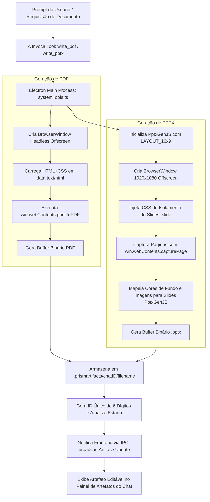

# Documentação Técnica: Geração e Manipulação NATIVA de PDFs e Apresentações PPTX no Prism

## 1. Visão Geral e Arquitetura

O **Prism** possui um motor avançado de compilação visual e geração de artefatos capaz de produzir documentos **PDF** com layout A4 e apresentações de slides **PowerPoint (.pptx)** em proporção 16:9.

Diferente de assistentes convencionais que apenas retornam código HTML bruto ou sintaxe Markdown, o Prism utiliza o próprio motor de renderização headless do Chromium/Electron associado a bibliotecas de baixo nível (`PptxGenJS`) para converter código web em arquivos binários reais e editáveis.

---

## 2. Visão Geral do Fluxo de Trabalho (Workflow Engine)



---

## 3. Especificação das Ferramentas (Tools Specification)

### 3.1 `write_pdf`
- **Descrição**: Compila um documento PDF de alta fidelidade visual a partir de HTML e CSS customizados.
- **Parâmetros**:
  - `filename`: Nome opcional do arquivo (ex: `relatorio_executivo.pdf`).
  - `html`: Conteúdo HTML+CSS completo do documento.
- **Armazenamento**: O arquivo é salvo no diretório de artefatos da conversa: `~/.prismartifacts/<chatId>/<filename>.pdf`.

### 3.2 `edit_pdf`
- **Descrição**: Atualiza um artefato PDF existente preservando seu identificador ou aceitando um novo caminho.
- **Parâmetros**:
  - `id`: ID único de 6 dígitos do artefato na conversa atual (ex: `849201`).
  - `path`: (Opcional) Caminho absoluto do arquivo PDF caso o ID não esteja disponível.
  - `html`: Novo código HTML+CSS atualizado.

### 3.3 `write_pptx`
- **Descrição**: Compila uma apresentação PowerPoint (.pptx) em formato widescreen (16:9) a partir de estruturas de slides HTML/CSS.
- **Parâmetros**:
  - `filename`: Nome do arquivo (ex: `apresentacao_vendas.pptx`).
  - `html`: Estrutura HTML contendo elementos com classe `.slide`, `section` ou `[data-slide]`.

### 3.4 `edit_pptx`
- **Descrição**: Atualiza os slides de uma apresentação `.pptx` existente mantendo o ID do artefato.
- **Parâmetros**:
  - `id`: ID único de 6 dígitos da apresentação.
  - `path`: (Opcional) Caminho absoluto do arquivo `.pptx`.
  - `html`: Novo código HTML+CSS dos slides.

---

## 4. Infraestrutura de Compilação

### 4.1 Infraestrutura de PDF (`compileHtmlToPdf`)
1. **Window Headless**: O Electron cria uma instância invisível de `BrowserWindow` com `show: false`.
2. **Carregamento de Data URI**: O HTML é codificado via `data:text/html;charset=utf-8,${encodeURIComponent(html)}` para garantir isolamento e velocidade sem gravar arquivos temporários intermediários.
3. **Impressão em PDF**: Utiliza `win.webContents.printToPDF()` com as configurações:
   - `printBackground: true`: Preserva cores de fundo, sombras e gradientes CSS.
   - `pageSize: 'A4'`: Define a folha padrão A4.
   - `preferCSSPageSize: true`: Permite que o CSS do documento sobrescreva dimensões usando regras `@page`.

### 4.2 Infraestrutura de PPTX (`compileHtmlToPptx`)
1. **Instanciação PptxGenJS**: Inicializa uma nova apresentação definindo a proporção widescreen 16:9 (`pptx.layout = 'LAYOUT_16x9'`).
2. **Viewport 1080p Offscreen**: Abre uma `BrowserWindow` headless com resolução fixa de **1920x1080 pixels**.
3. **Contagem e Isolamento de Slides**:
   - A página é inspecionada via script injetado para identificar seletores de slide (`.slide`, `section`, `.page`, `[data-slide]`).
   - Se nenhum seletor for encontrado, os elementos filhos diretos do `<body>` com altura > 80px são tratados como slides individuais.
4. **Captura Pixel-Perfect por Slide**:
   - Um estilo de captura (`prism-pptx-export-style`) é injetado, ocultando todos os outros slides (`display: none`) e renderizando apenas o slide atual em fullscreen 1080p (`100vw`, `100vh`).
   - A cor de fundo do elemento é analisada via `parseCssColorToHex` para aplicar no slide nativo do PowerPoint.
   - A captura de tela de alta resolução é obtida via `win.webContents.capturePage()`.
5. **Composição dos Slides**: Cada imagem obtida é anexada ao slide do PowerPoint ocupando exatamente 10 x 5.625 polegadas (dimensão nativa 16:9 no PptxGenJS).
6. **Mecanismo de Resiliência (Fallback)**: Caso a renderização offscreen falhe ou seja interrompida, o Prism ativa `compileHtmlToPptxFallback`, que limpa as tags HTML e gera os slides em formato de texto usando o compilador nativo do PptxGenJS.

---

## 5. Boas Práticas de Design para a IA

### 5.1 Boas Práticas para PDF
- **Regra `@page`**: Sempre inclua no estilo:
  ```css
  @page {
    size: A4;
    margin: 20mm 15mm;
  }
  ```
- **Quebra de Página**: Use a propriedade CSS `page-break-after: always;` ou `break-after: page;` para separar seções ou capítulos do documento.
- **Tipografia**: Use fontes limpas e seguras (ex: `Inter`, `Roboto`, `system-ui`, `Georgia`).
- **Tabelas e Gráficos**: Defina `width: 100%`, bordas sutis e `page-break-inside: avoid;` em tabelas longas para evitar cortes indesejados nas margens da folha.

### 5.2 Boas Práticas para PPTX (Slides)
- **Estrutura de Container**: Agrupe cada slide dentro de uma div marcada com a classe `.slide`:
  ```html
  <div class="slide">
    <h1>Título do Slide</h1>
    <p>Conteúdo em formato de tópicos...</p>
  </div>
  ```
- **Estilo Base dos Slides**:
  ```css
  .slide {
    width: 100%;
    height: 100vh;
    box-sizing: border-box;
    padding: 60px;
    background: #0f172a;
    color: #f8fafc;
    display: flex;
    flex-direction: column;
    justify-content: center;
  }
  ```
- **Hierarquia Visual**: Utilize títulos destacados (`h1`, `h2`), contraste marcante entre fundo e texto, e layouts em colunas (`display: grid` ou `flex`) para legibilidade ideal na apresentação.

---

## 6. Ciclo de Vida dos Artefatos e Atualização em Tempo Real

1. Os artefatos são salvos na pasta `.prismartifacts` do usuário.
2. Cada artefato recebe um **ID numérico aleatório de 6 dígitos**.
3. O evento de criação ou edição dispara o `broadcastArtifactsUpdate(chatId)` via Electron IPC.
4. O painel de artefatos na UI do Prism é atualizado instantaneamente, permitindo ao usuário:
   - Visualizar o PDF ou PPTX diretamente na interface.
   - Abrir o arquivo no software padrão do sistema (Adobe Reader, PowerPoint, WPS Office, etc.).
   - Solicitar alterações à IA citando o ID de 6 dígitos do artefato.
